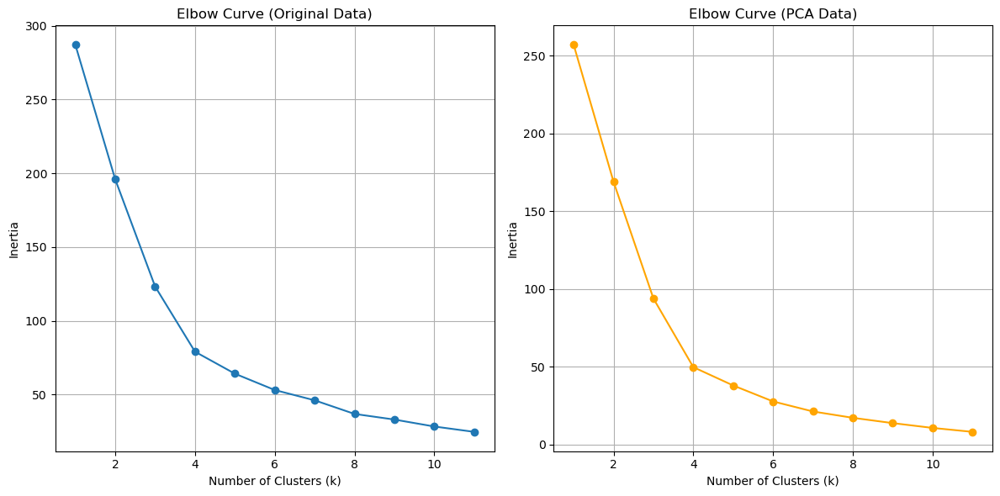
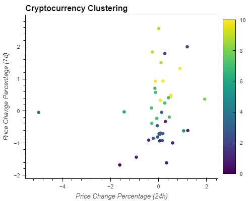
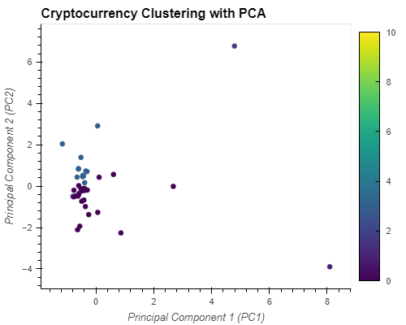

# CryptoClustering

## observations

**After visually analyzing the cluster analysis results, what is the impact of using fewer features to cluster the data using K-Means?**

By using PCA or any other dimensionality reduction technique, we project the data into fewer features while preserving as much of the variance as possible. This can be helpful in reducing the computational complexity and memory requirements of the clustering process. The sample data did not have that many dimensions, so it would have been ok to keep all the dimensions. 

However, reducing the dimensionality can also help in reducing noise or irrelevant features in the data, which might otherwise affect the clustering results. By focusing on the most informative features, we can potentially enhance the quality of the analysis.

